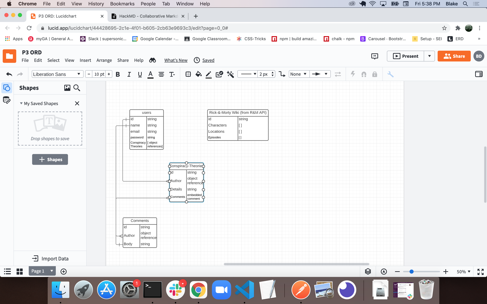

**Rickipedia & Mortiverse**
## Description:

Rickipedia & Mortiverse is a decoupled full-stack web application (Rickipedia being the front-end, and Mortiverse being the back-end) that lets users browse character, episode, and location information about Rick & Morty, and gives them a platform to post their own theories about the show and comment on other users' theories.

[https://rickipedia.herokuapp.com/]

## Technologies used:

- **Axios**: to access character, episode, and location information from a Rick and Morty API.
- **Bcrypt**: for hashing the users' passwords.
- **dotenv**: to load environment variables.
- **Passport**: for local authorization.
- **Cors**: to configure the web API security.
- **Express**: to facilitate the deployment of a node-based web application.
- **jsonwebtoken**: to securely manage user data.
- **mongoose**: to access and manipulate the MongoDB on the back-end.
- **passport-jwt**: to authenticate json web tokens.
- **jwt-decode**: to decode json web tokens.
- **react**: the front-end library.
- **react-dom**: provides DOM-specific methods to be used inside of the app.
- **react-router-dom**: for dynamic client-side navigation.
- **react-scripts**: sets up the development environment and start the server.
- **JavaScript**
- **Node.js**
- **PostgreSQL**
- **HTML5**
- **CSS**

## Approach

We brainstormed as a group to decide on the subject that would interest everyone in the group on a personal level, and that would lend itself to a specific design style.

We then whipped up a simple ORM to map out our collection relationships:

We were intially planning on simply making an axios call directly to a Rick & Morty API that we found, but the API did not include episode synopses, which was a feature that we wanted to include. So we created our own database and seeded it with all the relevant information from the API, and then entered episode synopses ourselves.

We then stubbed out the basic routes on the front and back ends and tested mapping and rendering pertinent data in their respective routes.

Once the basic wiki routes were functioning properly, we then added the 'theories' section and built the commenting feature.

Chassity and Jeremiah then stylized the living hell out of the front end, Patrick cleaned up CRUD operations, and Blake added audio rendering events to the nav bar links.

## Routes

**Back End**:

| Method | Path | Purpose |
| ------ | --------------- | ----------------- |
| POST    | /api/login   | logs in user |
| POST   | /api/signup | signs up user |
| PUT   | /api/update    | updates user profile |
| POST    | /api/profile   | displays user profile info |
| GET    | /wiki/theories   | finds all theories in the db and passes to front-end |
| POST    | /wiki/theories   | adds theories to the theory collection |
| POST    | /wiki/comment   | adds comments to theories collection |
| GET    | /wiki/characters   | finds all characters in db and passes to front-end|
| GET    | /wiki/episodes   | finds all episodes in db and passes to front-end|
| GET    | /wiki/locations   | finds all locations in db and passes to front-end|

### Front-end
| Path | Purpose |
| --------------- | ----------------- |
| /     | home page |
| /characters | displays image and name of all Rick & Morty characters |
| /character/:id   | displays more specific data on selected character  |
| /episodes | displays title and epsiode number of all episodes|
| /episode/:id   | displays episode synopsis and air date for selected epsiode, and provides link to an external website for more detailed synopsis  |
| /locations | displays a list of all prominent locations from Rick & Morty, as well as additional details for each |
| /character/:id   | displays more specific data on selected character  |
| /locations | displays a list of all prominent locations from Rick & Morty, as well as additional details for each |
| /theories | shows all user-posted theories and their associated comments|
| /about | displays info about the site's developers |
| /profile | shows profile data for logged-in user |
| /update | displays form for logged-in user to update their profile |
| /login | displays login form|